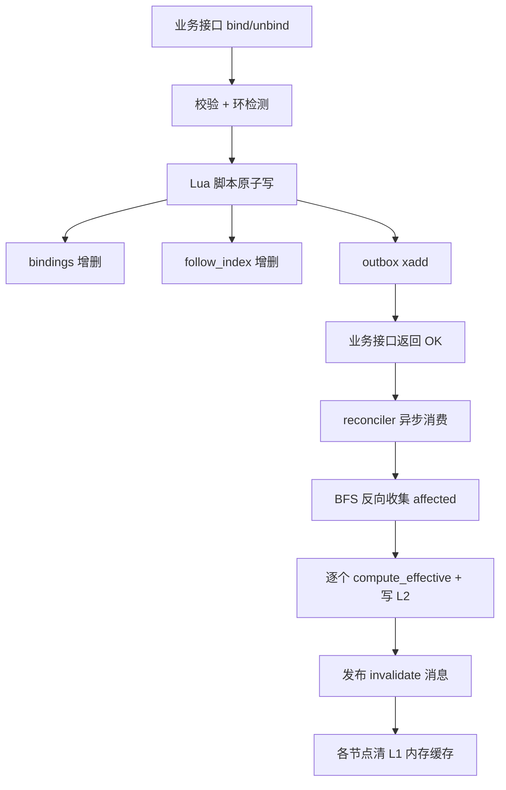
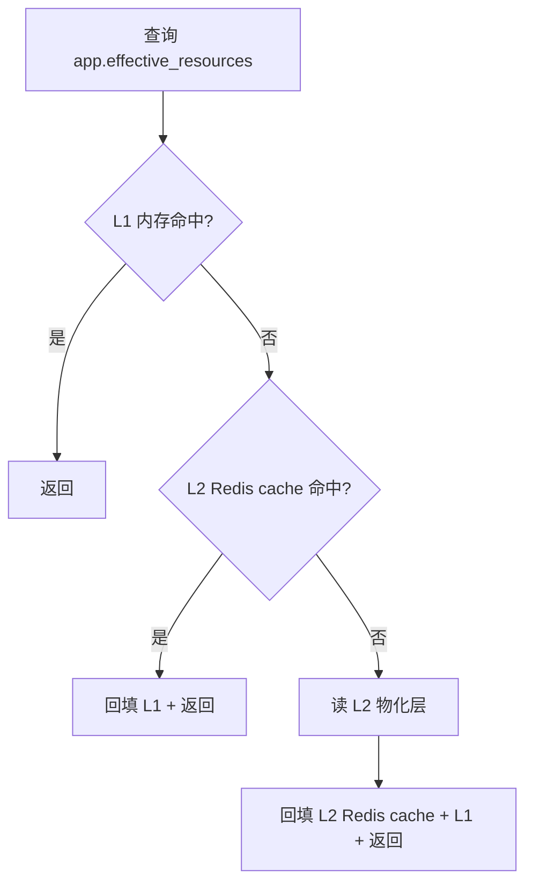

# 渠道-资源组多级绑定 设计文档

> 状态：草案（Draft，v2 — 已对齐现有 app driver）
> 适用范围：apinto 仓库
> 关键词：app / resource_group / 显式绑定 / 跟随继承 / 物化视图 / reconciler
>
> **术语约定**：
> - 业务侧/中文叙述使用"渠道"一词；
> - 实现层等同于 apinto 现有的消费者实体 [drivers/app](../../drivers/app)；
> - 文档中提到的 Channel / 渠道 / App / Application 在本设计中**指代同一实体**。

---

## 1. 背景

### 1.1 业务诉求

apinto 控制台需要按"渠道（即 App，对应 [drivers/app](../../drivers/app)）"维度做资源授权与配额隔离。每个 App 下挂载若干"资源组（resource_group）"，资源组承载具体的业务资源（API、上游、证书、Key 等）。

实际诉求中绑定关系存在两种模式：

- **显式绑定（explicit）**：当前节点主动选择并固定绑定某些子节点。
- **跟随继承（follow）**：当前节点的子集合等于其父节点的对应子集合，父节点变更时自动跟随。

`app → resource_group → resource` 两层都允许 explicit 和 follow 共存，因此系统中存在**多级穿透**：父渠道资源变更时，所有跟随它的下游渠道、跟随这些渠道的资源组、以及它们的有效资源集合都需要联动更新。

### 1.2 朴素方案的痛点

最朴素的做法是用 Redis hash 直接存绑定，例如：

```
hset binding:tenant:{tenant_id} groups [g1,g2,...]
hset binding:group:{gid}   resources [r1,r2,...]
```

这种结构在多级穿透场景下有三大问题：

| 痛点 | 原因 |
|---|---|
| **反向查询难** | 知道 app→groups 容易；但"哪些 App 在跟随我？"需要全表扫描 |
| **级联更新成本高** | 父级动一下要递归找所有跟随者，hash 没法表达图结构，逻辑塞进业务代码 |
| **一致性脆弱** | 写多个 hash 没有事务，中途失败留半成品；缓存层与权威源容易漂移 |

### 1.3 设计原则

1. **关系一份事实，派生一份缓存**：关系是权威源（fact），物化集合是派生（derivation），后者随时可重建。
2. **写只动事实，读只走缓存**：业务接口只写关系层，读永远走物化层 / 缓存层。
3. **递归从读路径搬到写路径**：通过 reconciler 异步扇出展开，读路径完全无递归。
4. **可恢复**：物化视图任何时刻可由关系层全量重算；缓存层可由物化层热补。

---

## 2. 设计目标与非目标

### 2.1 目标

- 单次"渠道→有效资源集合"查询 O(1)，纯哈希命中
- 单次绑定/解绑业务接口的同步写代价 O(1)，逻辑只写关系表 + 投递事件
- 跟随模式下的级联同步在秒级内最终一致
- 故障恢复期内可由关系层一键重建所有派生数据
- 不引入新的存储依赖（仅复用现有 ICache / Redis）

### 2.2 非目标

- 不解决渠道间的资源权限审批流（这是上层流程引擎职责）
- 不在本设计内提供可视化绑定关系拓扑（管理面 UI 单独迭代）
- 不提供跨集群强一致（基于 Redis 的最终一致即可）

---

## 3. 核心概念

### 3.0 术语与实体划分

本设计不复用 `drivers/app` 作为租户载体。业务层 5 个名词**各自独立建模**，同一个实体决不身兼两职：

| 业务名词 | 含义 | 实现层载体 |
|---|---|---|
| **租户 Tenant** | 资源组的创建者与层级节点；呈树形结构（顶级租户、子租户、孙租户…递归同构）。租户本身**不直接拥有资源**；租户可见的资源 = 它创建的所有资源组创建的资源之并 ∪ 从父租户 granted 过来的资源组中的资源。 | **新建** [drivers/tenant/](../../drivers/) |
| **资源 Resource** | API 服务 / 大模型服务 / 上游 / 证书 / Key 等。**由某个 ResourceGroup 创建出来**，创建者组是资源的唯一 owner。 | 现有 worker（api / service / upstream / ai-key…） |
| **资源组 ResourceGroup** | 归属某个 Tenant；是资源的创建单位；在 `explicit_resources` / `follow_tenant` 两种 mode 中二选一。同一租户下不同资源组之间可以“分配”资源（不转移 owner，仅加一条引用）。 | **新建** [drivers/resource_group/](../../drivers/) |
| **消费者 App** | 运行期鉴权主体。**不归属任何租户**。通过 M:N 绑定一组 ResourceGroup 获得可见资源。 | 现有 [drivers/app](../../drivers/app)（不修改 Config） |
| **渠道 Channel（= 待审批的子租户申请）** | 个人用户在某租户内提交入驻申请。审批通过后生成一个子租户实例，并被父租户 granted 一个资源组。 | 新建 [drivers/tenant-application/](../../drivers/) |

> **资源的创建 / 拥有 / 可见**三个词严格区分：
> - **创建 creates**：资源由某个 ResourceGroup 一次性创建出来，实体存于该组；同一资源只能被一个组创建。
> - **拥有 owns**（资源组侧）：一个 ResourceGroup 能“拥有”的资源 = 它创建的 ∪ 同租户其他组分配过来的（或在 follow 模式下 = 全租户集合）。
> - **可见 visible**（App 侧）：App 能看到的资源 = 它 binds 的所有组的 owns 之并。
>
> **与现有 [drivers/app](../../drivers/app) 的边界**：App 仅作为鉴权主体，不创建资源、不创建资源组、不参与租户层级。运行期鉴权拿到 `app_id` 后，走 `app -[binds]-> ResourceGroup -[…]-> Resource` 这条链拿可见资源集，**不走 Tenant 节点**。

### 3.1 实体与边

五类节点，八类边（详细 schema 见 §4.2）：

| 边 | 含义 | 写入方 |
|---|---|---|
| `ResourceGroup -[ownedBy]-> Tenant` | 资源组创建者，不可变 | `CreateGroup` |
| `ResourceGroup -[creates]-> Resource` | 资源由该组创建；该组是该资源的唯一 owner | `CreateResource(in_group=g)` |
| `ResourceGroup -[allocated]-> Resource` | 同租户另一个组创建的资源被分配进本组；**源 group 与 dst group 必须 ownedBy 同一 Tenant** | `AllocateResource(src_gid, dst_gid, rid)` |
| `ResourceGroup -[follow]-> Tenant` | mode=follow_tenant 下镜像 owner Tenant 的资源全集（详 §3.2） | `CreateGroup` mode=follow |
| `Tenant -[parentOf]-> Tenant` | 渠道审批通过时建立的父-子关系 | 审批事务 |
| `Tenant -[granted]-> ResourceGroup` | 父租户把某个 group 授予子租户使用。**只读使用 + 可再分发**，不可修改 group 内部 | `GrantGroupToChild` |
| `App -[binds]-> ResourceGroup` | 消费者订阅某资源组；**M:N**，App 可绑多组、组可被多 App 绑 | `BindAppGroup` |
| `Resource -[createdBy]-> ResourceGroup` | 反向索引：资源 → 创建组（鉴权与删除环检测用） | `CreateResource` 同步写入 |

> **Tenant 不再直接拥有 Resource**。原本 v4 的 `Tenant -[owns]-> Resource` 边被废除，`tenant.owns` 变为物化派生量：“该租户创建的所有资源组创建的资源之并”。推出后的最大不同：**粒度全部下沉到 group**。

资源组节点内部结构：

```
ResourceGroup G {
  owner_tenant_id: T,                     // ownedBy 不可变
  mode: explicit_resources | follow_tenant,
  created_resources:   [r_x, r_y, ...]    // 本组创建的资源（唯一 owner）
  allocated_resources: [r_p, r_q, ...]    // 同租户其他组分配过来的资源
}
```

> 同一租户下资源 `r` 与其创建组是一一关系；但同一 `r` 可被该租户多个组 `allocated`（多到一）。跨租户不能直接 allocated（跨租户只能走 `granted` 路径传递可见性）。

> **不修改** [drivers/app/config.go](../../drivers/app/config.go) 的 `Config{Anonymous, Disable, Additional, Auth, Labels}`，App 鉴权仍走现有 [application/auth](../../application/auth) 体系。`app -[binds]-> group` 的 M:N 关系以独立关系层存于 Redis，详见 §4-5。

### 3.2 资源组的 mode

设 `T = G.owner_tenant_id`，`tenant_resources(T) = ⋃ {created_resources(g) | g.ownedBy = T}` 是租户创建资源全集。

| mode | 定义（只看该租户范围内的可见性） | 典型场景 |
|---|---|---|
| `explicit_resources` | `eff(G) = created_resources(G) ∪ allocated_resources(G)`；owner 租户之后在另一组里创建新资源不会自动补入本组 | 锁定范围的业务线 |
| `follow_tenant` | `eff(G) = tenant_resources(T)`（动态镜像本租户创建资源全集）；**忽略本组的 created_resources / allocated_resources** | 默认子组，跟随租户能力增量 |

> follow 模式下**仍可在该组中创建资源**（`created_resources` 会反哺到 tenant_resources(T)，从而被本组 follow 看见）；但不接受 `allocated`（语义冗余，follow 已含全集）。

### 3.3 穿透示例（用户需求场景）

```
租户 T 下存在 3 个资源组：
  G_A  mode=explicit
  G_B  mode=explicit
  G_C  mode=follow_tenant

步骤1：在 G_A 中创建 A1, A2, A3
  created_resources(G_A) = {A1, A2, A3}
步骤2：在 G_B 中创建 B1, B2, B3
  created_resources(G_B) = {B1, B2, B3}
步骤3：将 A1、A2 从 G_A 分配给 G_B
  allocated_resources(G_B) = {A1, A2}

于是：
  eff(G_A) = created ∪ allocated  = {A1, A2, A3} ∪ ∅         = {A1, A2, A3}
  eff(G_B) = created ∪ allocated  = {B1, B2, B3} ∪ {A1, A2}  = {A1, A2, B1, B2, B3}
  tenant_resources(T)             = created(G_A) ∪ created(G_B) ∪ created(G_C)
                                  = {A1, A2, A3} ∪ {B1, B2, B3} ∪ ∅
                                  = {A1, A2, A3, B1, B2, B3}
  eff(G_C) = follow_tenant         = tenant_resources(T)            = {A1, A2, A3, B1, B2, B3}
```

> 注意几点：
> 1. `eff(G_A)` 仍为 `{A1, A2, A3}`——A1/A2 被“分配”出去后 G_A 仍是 owner，**资源不会从 G_A 移走**；alloc 只是加了一条引用边。
> 2. `tenant_resources(T)` 只累加 `created`，不累加 `allocated`——`allocated` 没有引入新资源，只改变了某资源在哪些组里可见。
> 3. `G_C` follow 后看到的是租户创建全集，与 G_A/G_B 是否发生过 allocate 无关。

跨租户场景（复用 §6 给出的例）：

```
顶级租户 T0：组 G_A(explicit, created=[r1,r2]) 、 G_B(explicit, created=[r3])
         tenant_resources(T0) = {r1, r2, r3}
         G_FOLLOW(follow_tenant) 看到 = {r1, r2, r3}
         T0 granted G_A 给子租户 T1

子租户 T1（parent=T0）：组 G_X(explicit, created=[r4])，从 T0 拿到 G_A
         tenant_resources(T1) = {r4}                                     ← 只累加 T1 自己创建的
         eff(T1) 可见集 = tenant_resources(T1) ∪ eff(G_A)
                          = {r4} ∪ {r1, r2}    = {r1, r2, r4}
         T1.G_FOLLOW 看到 = tenant_resources(T1) = {r4}                  ← follow 只看本租户创建的
         T1.G_ALL_VIA_GRANT 是 T0 granted 过来的 G_A，独立体现
```

**运行期鉴权**只查 `eff(app)`： `ResolveAppResources(app_id)` O(1)。
**控制台可视化**拉 `eff(tenant)`： `ResolveTenantResources(tenant_id)` O(1)（“这个租户能为子级分发出去的资源集合 = tenant_resources(T) ∪ granted-from-parent 传递过来的 group 资源”）。

### 3.4 granted 的“可再分发但不可改”约束

父租户把 `G` granted 给子租户 T_child 后（`G.ownedBy ≠ T_child`）：

| 动作 | T_child 是否可以 |
|---|---|
| 查 G 的 `eff(G)` / mode | ✅ |
| 让自己的 App 绑定 G（`App -[binds]-> G`） | ✅ |
| 把 G 再 granted 给孙租户 T_grandchild | ✅（**需环检测**） |
| 在 G 里 `created` 新资源 | ❌（仅 owner 可创建） |
| 将 G 的资源分配到 T_child 自己创建的某个组 | ❌（`allocate` 仅同 owner Tenant 内生效） |
| 修改 G 的 mode / created / allocated | ❌ |
| 删除 G | ❌（仅 owner Tenant 可删） |
| 把 G 的 owner_tenant_id 转走 | ❌ |

写路径检测：

- `CreateResource(in_group=g)` / `AllocateResource(src_gid, dst_gid, rid)` / `DeallocateResource(dst_gid, rid)` / 改 mode 的接口，在 Lua 预检 `caller_tenant_id == ownedBy(group)`，否则拒绝。
- `AllocateResource` 额外预检 `ownedBy(src_gid) == ownedBy(dst_gid)`（同租户约束）且 `rid ∈ created_resources(src_gid)`（只能从创建组分配，不能转手分配 allocated 的引用）。
- `GrantGroupToChild(grantor_tid, grantee_tid, gid)` 在 Lua 预检 “grantor 于 gid 上有访问权”，即 grantor == ownedBy(gid) 或 gid ∈ grantor.granted_from；避免跨枝 granting。
- `DeleteResource(rid)` 仅创建组 owner 可调；预检需 `rid ∉ ⋃ allocated_resources(g) for g ∈ same_tenant`，否则报错 `resource_in_use`。

### 3.5 渠道审批流（TenantApplication 生命周期）

```
[用户提交]                       [父租户审批]                  [作为子租户运行]
TenantApplication.pending  →  reviewed=approved  →  生成 child Tenant
  - parent_tenant_id: T0       - reviewer、ts                   - drivers/tenant 创建实例
  - applicant、labels           - granted_groups: [G1, G2…]   - 写 Tenant -[parentOf]-> child
                                                                  - 写 Tenant -[granted]-> Group ×N
                                                                  - reconciler 重算 eff(child)
```

- `pending` 不进入关系层，不占用 effective 计算资源。
- `approved` 后一次原子脚本同时完成：创建子租户 [drivers/tenant](../../drivers/) 实例 + 写入两类边（parentOf / granted） + 投 outbox。
- `rejected` / `withdrawn` 不调关系层。
- 审批流本身（批准人、多级会签）**不在本设计范围**，交上层流程引擎实现；本文只提供 approved 事件的“落地接口”。

---

## 4. 三层数据模型

### 4.1 总览

```
┌─────────────────────────────────────────────┐
│ L1 关系层（事实表，唯一权威源）              │
│    bindings 表：八类边                       │
│    follow_index 表：反向索引                  │
├─────────────────────────────────────────────┤
│ L2 物化层（派生视图，可重建）                 │
│    group_effective_resources                  │
│    tenant_effective_resources                  │
│    app_effective_resources    ← 运行期热路径   │
├─────────────────────────────────────────────┤
│ L3 缓存层（L1 内存 / L2 Redis hash）          │
│    apinto:cache:app:{app_id}:effective         │
│    版本号 + lazy load                          │
└─────────────────────────────────────────────┘
```

### 4.2 关系层（L1）

#### 4.2.1 bindings（8 类边）

每类边一个 Redis hash，按 parent 分桶以便枚举：

```
# 1. ResourceGroup -[ownedBy]-> Tenant（存在 group 元数据里，见 4.2.3）
#    反向枚举：apinto:bind:tenant:{tid}:owned_groups（HASH gid → ts）
HSET apinto:bind:tenant:{tenant_id}:owned_groups
     {gid}        {"ts":...}

# 2. ResourceGroup -[creates]-> Resource（资源由该组创建；唯一 owner）
HSET apinto:bind:gp:{gid}:created_resources
     {rid}        {"ts":...}
#    反向：Resource -[createdBy]-> ResourceGroup（资源 → 创建组，唯一）
SET  apinto:bind:resource:{rid}:created_by   {gid}

# 3. ResourceGroup -[allocated]-> Resource（同租户其他组分配过来；多到一）
HSET apinto:bind:gp:{gid}:allocated_resources
     {rid}        {"src_gid":"{src}","ts":...}
#    反向：Resource 在哪些组里被 allocated（用于删除资源时的环检测）
HSET apinto:bind:resource:{rid}:allocated_in
     {gid}        {"ts":...}

# 4. ResourceGroup -[follow]-> Tenant（仅 mode=follow_tenant，follower 一般 = ownedBy）
HSET apinto:bind:gp:{gid}:follow_tenants
     {tenant_id}  {"ts":...}

# 5. Tenant -[parentOf]-> Tenant（渠道审批后建立）
HSET apinto:bind:tenant:{tenant_id}:children
     {child_tenant_id}  {"ts":...}
SET  apinto:bind:tenant:{child_tenant_id}:parent  {parent_tenant_id}

# 6. Tenant -[granted]-> ResourceGroup（父授权子，可再分发但不可改）
HSET apinto:bind:tenant:{grantee_tenant_id}:granted_groups
     {gid}        {"granted_by":"{grantor_tenant_id}","ts":...}
HSET apinto:bind:gp:{gid}:granted_to
     {grantee_tenant_id}  {"granted_by":"{grantor_tenant_id}","ts":...}

# 7. App -[binds]-> ResourceGroup（M:N，运行期鉴权入口）
HSET apinto:bind:app:{app_id}:groups
     {gid}        {"ts":...}
HSET apinto:bind:gp:{gid}:apps         ← 反向索引，group 变动时找到受影响 app
     {app_id}     {"ts":...}
```

> **不再有 `Tenant -[owns]-> Resource` 边**。租户维度的资源集是物化派生量（见 §4.3），由 reconciler 累加各资源组的 `created_resources` 得到。

> 单条 hash 字段容量足够大；只要 parent 维度的子边数控制在万级以内即可一次 HGETALL 全量拉取。热点 parent 过大可拆分为 SET + meta hash。

#### 4.2.2 follow_index（反向索引）

跟随边天生有反向查询需求：“哪些资源组在跟随某 Tenant？哪些 App 在 binds 某 group？” reconciler 必须能 O(1) 拿到：

```
SADD apinto:follow_idx:tenant:{tenant_id}    group:{follower_gid}        # mode=follow_tenant 资源组
SADD apinto:follow_idx:gp:{gid}              app:{app_id}                  # binds 该 group 的 App 列表
SADD apinto:follow_idx:tenant:{parent_tid}   tenant:{child_tid}            # 子租户
SADD apinto:follow_idx:gp:{gid}              tenant:{grantee_tid}          # granted 到哪些租户
```

每写一条跨实体边（follow / binds / parentOf / granted）同步写 follow_index；删除边时同步删除。

#### 4.2.3 元数据

```
HSET apinto:meta:tenant:{tenant_id}    name=... created_at=... parent_tenant_id=... ...
HSET apinto:meta:gp:{gid}              name=... owner_tenant_id=... mode=... ...
HSET apinto:meta:app:{app_id}          name=... created_at=... ...      # 与 drivers/app worker 配置互补不冲突
```

> Tenant、App 的名称与鉴权配置分别由新建 [drivers/tenant](../../drivers/) / 现有 [drivers/app](../../drivers/app) 的 worker 配置管理，本处 `apinto:meta:*` hash 只存与绑定相关的补充元数据（创建时间、归属人、labels……）。

`group.owner_tenant_id` 是资源组反查“谁创建了我”的唯一源，并作为 `BindGroupResource` 之类接口鉴权主体（§3.4 约束）。

### 4.3 物化层（L2）

三个维度物化“展开后的终态资源 ID 集合”。**不存路径，只存终态。**

```
SET  apinto:eff:gp:{gid}:resources              → SET<resource_id>     # 资源组物化
SET  apinto:eff:tenant:{tenant_id}:resources    → SET<resource_id>     # 控制台可视化 / 重算中间结果
SET  apinto:eff:app:{app_id}:resources          → SET<resource_id>     # 运行期鉴权热路径
```

附带版本号便于缓存失效与 ABA 检测：

```
HSET apinto:eff_ver  group:{gid}:resources           v=17 ts=...
HSET apinto:eff_ver  tenant:{tenant_id}:resources    v=42 ts=...
HSET apinto:eff_ver  app:{app_id}:resources          v=88 ts=...
```

三者关系：

```
tenant_resources(T) = ⋃ created_resources(g)  for g ∈ T.owned_groups   (派生，租户创建资源全集)

eff(group g)        = mode=explicit  → created_resources(g) ∪ allocated_resources(g)
                      mode=follow    → tenant_resources(g.ownedBy)
eff(tenant T)       = tenant_resources(T) ∪ ⋃ eff(g)  for g ∈ T.granted_groups   (含父级 granted)
eff(app a)          = ⋃ eff(g)  for g ∈ a.binds
```

物化层的所有写入只能由 reconciler 进行（详见 §6）。业务接口禁止直接修改 L2。

### 4.4 缓存层（L3）

L3 是物化层的**热点快照**，运行期鉴权只关心 `eff(app)`：

- 进程内 L1（in-memory）：避免每次都打 Redis
- Redis L2：跨节点共享读快照

```
in-mem:  app:{app_id}:effective:resources           → SET, lru
redis :  apinto:cache:app:{app_id}:effective        → SET, ttl
```

**写策略**：reconciler 完成 L2 写入后，发布 invalidate 消息（Redis Pub/Sub）携带 `app:{app_id}` key，所有 apinto 节点收到后清掉对应 L1；下一次读时 lazy 拉 L2 回填。

> 控制台“查某租户可分配资源”的读路径不在运行期热路径上，可以直接读 L2 `eff:tenant:*`，不必走 L1。

---

## 5. Redis Key 命名规约

| 用途 | Key | 类型 |
|---|---|---|
| 关系层：Tenant 创建的资源组列表 | `apinto:bind:tenant:{tenant_id}:owned_groups` | HASH |
| 关系层：Tenant 的子租户列表 | `apinto:bind:tenant:{tenant_id}:children` | HASH |
| 关系层：Tenant 的父租户 | `apinto:bind:tenant:{tenant_id}:parent` | STRING |
| 关系层：Tenant 从父 granted 来的资源组 | `apinto:bind:tenant:{tenant_id}:granted_groups` | HASH |
| 关系层：资源组 granted 到哪些租户 | `apinto:bind:gp:{gid}:granted_to` | HASH |
| 关系层：资源组创建的资源（唯一 owner） | `apinto:bind:gp:{gid}:created_resources` | HASH |
| 关系层：资源组被分配进的资源（同租户引用） | `apinto:bind:gp:{gid}:allocated_resources` | HASH |
| 反向：资源 → 创建组 | `apinto:bind:resource:{rid}:created_by` | STRING |
| 反向：资源 → 在哪些组被 allocated | `apinto:bind:resource:{rid}:allocated_in` | HASH |
| 关系层：资源组→跟随 Tenant（follow_tenant） | `apinto:bind:gp:{gid}:follow_tenants` | HASH |
| 关系层：App 绑定的资源组（M:N） | `apinto:bind:app:{app_id}:groups` | HASH |
| 关系层：资源组被哪些 App 绑定 | `apinto:bind:gp:{gid}:apps` | HASH |
| 反向索引：Tenant 被哪些节点跟随 / 引用 | `apinto:follow_idx:tenant:{tenant_id}` | SET |
| 反向索引：资源组被哪些节点跟随 / 引用 | `apinto:follow_idx:gp:{gid}` | SET |
| 物化：资源组有效资源 | `apinto:eff:gp:{gid}:resources` | SET |
| 物化：Tenant 可分配资源集 | `apinto:eff:tenant:{tenant_id}:resources` | SET |
| 物化：App 可见资源集（运行期热路径） | `apinto:eff:app:{app_id}:resources` | SET |
| 物化版本 | `apinto:eff_ver` | HASH |
| 缓存（App 维度跨节点共享） | `apinto:cache:app:{app_id}:effective` | SET, ttl=10m |
| reconciler outbox | `apinto:reconcile:outbox` | STREAM |
| reconciler 处理中标记 | `apinto:reconcile:lock:{node_key}` | STRING, ttl=30s |
| 元数据（补充） | `apinto:meta:tenant:{tid}` / `apinto:meta:gp:{gid}` / `apinto:meta:app:{aid}` | HASH |

统一前缀 `apinto:` 保证与现有计费等模块（`apinto:billing:*`）物理隔离。

> `node_key` 取值为 `tenant:{tenant_id}` / `group:{gid}` / `app:{app_id}`，用于 reconciler 内部节点串行化。

---

## 6. 关键算法

查询与写路径都遵循“写时扇出、读时 O(1)”；三个物化维度（group / tenant / app）同名不同参数。

### 6.1 compute_effective_group

```
function compute_effective_group(gid):
    g = read_group_meta(gid)
    if g.mode == "explicit_resources":
        return  HKEYS(apinto:bind:gp:{gid}:created_resources)
              ∪ HKEYS(apinto:bind:gp:{gid}:allocated_resources)
    elif g.mode == "follow_tenant":
        return  tenant_resources(g.owner_tenant_id)               # 依靠 6.2 中间产物
```

资源组本身不递归、不跳子租户；owner Tenant 在另一个组里创建资源时只影响 `mode=follow_tenant` 的资源组（通过 `tenant_resources` 中间产物传递）。

### 6.2 compute_effective_tenant（控制台可视化用）

先引入中间产物 `tenant_resources(T)`：该租户创建的所有资源组创建的资源之并（**只累 created，不累 allocated**）：

```
function tenant_resources(tid):                     # 物化为 apinto:eff:tenant:{tid}:created_resources
    result = set()
    for gid in HKEYS(apinto:bind:tenant:{tid}:owned_groups):
        result ∪= HKEYS(apinto:bind:gp:{gid}:created_resources)
    return result
```

```
function compute_effective_tenant(tid):              # 物化为 apinto:eff:tenant:{tid}:resources
    result = tenant_resources(tid)
    for gid in HKEYS(apinto:bind:tenant:{tid}:granted_groups):
        result ∪= eff(gid)                          # 读 L2 apinto:eff:gp:{gid}:resources
    return result
```

> tenant_effective 不含“子租户创建的额外资源”——那些在子租户维度物化。本集合表示“该租户在其控制范围内可分发出去的全部资源”。

### 6.3 compute_effective_app（运行期热路径）

```
function compute_effective_app(app_id):
    result = set()
    for gid in HKEYS(apinto:bind:app:{app_id}:groups):
        result ∪= eff(gid)              ← 读 L2 apinto:eff:gp:{gid}:resources
    return result
```

App 不递归进入 Tenant；只走 `app -[binds]-> group` 一跳，后续资源从 group 的物化结果拿，避免跨租户层级遍历。

### 6.4 受影响节点反向收集

某条边 e 变更时需要重算哪些节点？按边类型分档（T = 所属租户）：

| 变更边 | affected (group) | affected (tenant) | affected (app) |
|---|---|---|---|
| Group.created 增/删 r | `gid` 本身 + `tenant_resources(T)` 变 → T.owned_groups 中 follow 模式的所有 group | `T` 本身 + granted_to 中所有 grantee Tenant | `follow_idx:gp:{gid}` 中全部 + follow group 反查出的 app |
| Group.allocated 增/删 r | `gid` 本身（不动 tenant_resources） | granted_to 中 grantee Tenant | `follow_idx:gp:{gid}` 中全部 |
| Group.mode 变 | `gid` 本身 | granted_to 中 grantee Tenant | 同上 |
| Tenant -[granted]-> Group 增/删 | — | grantee Tenant | 该 grantee 下 App（仅那些 binds 了该 group 的 app） |
| App -[binds]-> Group 增/删 | — | — | `app_id` |
| Tenant -[parentOf]-> Tenant 增/删 | — | 子树全部 Tenant | 受影响 Tenant 下的 App |

```
function affected_nodes(event):
    affected = {}
    seed     = event.root_node
    follow follow_idx:* / parentOf BFS 反向展开，按上表填充
    return affected
```

最后逐节点调 `compute_effective_group/tenant/app`，CAS 写 L2 并广播 invalidate。

### 6.5 写时扇出

```
on Create*/Allocate*/Deallocate*/Bind*/Unbind*/Grant*/Revoke* 事务：
    1. 鉴权与环检测（§6.6）
    2. Lua 原子写入：
         - bindings 增/删一条
         - follow_index 同步增/删
         - outbox XADD 一条 reconcile 事件 {root, op_kind, ts}
    3. 业务接口立即返回
```

### 6.6 环检测与鉴权

三类预检须拦截：

1. **Tenant parentOf 环**：审批 / 调整 parent 时，父链不能包含 child。`add_parent(child, parent)` 需验证 child 不在 ancestors(parent) 中。
2. **granted 再分发环**：T_grandchild 不得把从 T_child 拿到的 G 反向 grant 回 T_child 的祖辈；`GrantGroupToChild(grantor, grantee, gid)` 需验证 grantee 不在 ancestors(grantor) 中且 gid 不在 grantee 本身已持有集合中（避免重复 granted）。
3. **分配的环 / 跨租户防御**：`AllocateResource(src_gid, dst_gid, rid)` 需验证 `ownedBy(src_gid) == ownedBy(dst_gid)`（同租户）且 `rid ∈ created_resources(src_gid)`（只能从创建组出，不能转手分配 allocated）且 `rid ∉ created_resources(dst_gid)`（避免自分配、以及 dst 已是 owner 的冗余 alloc）。

granted 鉴权（`grantor` 是否有资格把 `gid` granted 出去）二者之一成立即可：

- `grantor == ownedBy(gid)`——创建者本人
- `gid ∈ grantor.granted_from`——grantor 自己也是从别人那里 granted 来的（可再分发）

上述项都应在 Lua 脚本预检，不足则拒绝并不入 outbox。

### 6.7 资源生命周期与垃圾回收约束

资源 `r` 的 owner 是其创建组 `g0`（反向索引 `bind:resource:{rid}:created_by`）。生命周期规则：

- **仅创建组可删除资源**。`DeleteResource(rid)` 需满足：
  - caller 是 `created_by(rid)` 对应 group 的 ownedBy Tenant；
  - `rid ∉ ⋃ allocated_resources(g)` for `g ∈ same_tenant`（任何同租户组都未引用），否则报 `resource_in_use`；
  - 原子删 `bind:gp:{g0}:created_resources/{rid}` + `bind:resource:{rid}:created_by`。
- **资源组删除**（`DeleteGroup(gid)`）需满足：`gid ∉ 任何 tenant.granted_groups`（未被 grant 出去）且 `gid ∉ 任何 app.binds`（未被 App 绑定）且 `created_resources(gid) = ∅`（已先行删除本组创建的资源）。`allocated_resources(gid)` 删除时随之清理反向索引。
- **租户删除**（`DeleteTenant(tid)`）需满足：`tid` 无子租户、`tid` 创建的所有资源组均可安全删除、未从父 granted 任何组。

---

## 7. 写路径与读路径

### 7.1 写路径



业务侧只感知到 A→E 五步，毫秒级；F 之后是异步收敛过程，秒级。

### 7.2 读路径



读路径**不允许**触发 reconcile，永远只走快照。

---

## 8. reconciler 状态机

### 8.1 组件

- **Outbox 消费者**：监听 `apinto:reconcile:outbox` 流，每个事件包含 `{root_node, ts, op_id}`。
- **任务调度器**：按 `node_key` 串行化（同一节点不并发处理）。
- **执行器**：调用 `affected_nodes` + `compute_effective` + 写 L2 + invalidate。
- **失败重试器**：指数退避，最多 N 次后转入死信流。

### 8.2 状态机

```
[Pending] --consume--> [Running] --done--> [Acked]
                            |
                            +--fail--> [Retry] --(N+1)--> [Running]
                                              \
                                               +--exceed--> [DLQ]
```

### 8.3 幂等保证

- `op_id` 作为幂等键，已处理的 op_id 写入 `apinto:reconcile:done` 集合（带 24h ttl）。
- 同一 node_key 在 `compute_effective` 之前抢锁 `apinto:reconcile:lock:{node_key}`，避免并发覆盖。
- 物化层写入用 `version + 1` CAS：仅当当前版本 = 读时版本才覆盖，否则丢弃本次结果（说明已有更新版本完成）。

### 8.4 全量重建

提供运维接口 `POST /admin/reconcile/rebuild`：

```
function rebuild_all():
    for tenant_id in all_apps():
        push_outbox({root: app:tenant_id, op_id: <run_id+tenant_id>})
    for gid in all_groups():
        push_outbox({root: gp:gid, op_id: <run_id+gid>})
```

通过 outbox 驱动现有 reconciler 重算所有派生数据。可在迁移、灾难恢复或排查后调用。

---

## 9. 一致性与容错

| 场景 | 行为 |
|---|---|
| 业务写后立即读 | 读到旧 L2 快照（最终一致），UI 可显示"同步中"标记 |
| Lua 脚本部分失败 | 整体回滚（Redis 单脚本原子）|
| outbox 写成功但 reconciler 宕机 | Stream 持久化，重启后续消费 |
| reconciler 计算成功但 L2 写失败 | 不 ack outbox，下次重试 |
| L2 写成功但 invalidate 失败 | L1 仍是旧值，靠 ttl（10m）兜底；运维可手动触发 invalidate |
| Redis 主从切换丢数据 | 由 outbox 历史 + 关系层重建（rebuild_all）|
| 长跨度环 / 异常 follow 链 | 环检测前置拒绝；运行期 visited 兜底防死循环 |

---

## 10. API 契约

> 仅约定语义，具体路由和参数命名由控制台 / 管理面侧确定。

### 10.1 写接口

按主体分组：Tenant、Resource（位于某个 Group 内）、Group、Tenant↔Group（granted）、App↔Group（binds）、审批。

#### 10.1.1 Tenant 层级

| 接口 | 语义 | 备注 |
|---|---|---|
| `CreateTenant(tenant_id, parent_tenant_id?)` | 创建顶级或子租户；parent 可为空 | 作为审批事务的内部原子动作 |
| `DeleteTenant(tenant_id)` | 删除租户；需 §6.7 约束全部满足 | reconciler 后续重算 affected app |

> 租户本身不提供 `BindTenantResource` / `UnbindTenantResource`；资源是从 **某个 Group 下创建出来的**，租户维度资源集是派生量。

#### 10.1.2 ResourceGroup 创建与 mode

| 接口 | 语义 | 鉴权主体 |
|---|---|---|
| `CreateGroup(owner_tenant_id, mode)` | 创建资源组（初始 created/allocated 均为空） | owner_tenant_id |
| `DeleteGroup(gid)` | 仅 owner Tenant 可删；需 created_resources=∅ 且未被 granted/binds | ownedBy(gid) |
| `ChangeGroupModeToExplicit(gid, snapshot[])` | follow_tenant → explicit_resources；推荐快照当前 eff(group) 锁定到 created/allocated（仅允许同租户范围内的资源锁定） | ownedBy(gid) |
| `ChangeGroupModeToFollow(gid)` | explicit_resources → follow_tenant；原有 created 保留（仍计入 tenant_resources），allocated 被丢弃 | ownedBy(gid) |

#### 10.1.3 Resource 创建与同租户分配

| 接口 | 语义 | 鉴权主体 |
|---|---|---|
| `CreateResource(in_group_id, payload)` | 在某个资源组中创建资源（API/上游/AI Key …）；created_by = in_group_id，owner = ownedBy(in_group_id) | ownedBy(in_group_id) |
| `DeleteResource(rid)` | 仅创建组 owner Tenant 可删；需 §6.7 约束满足（未被任一 same-tenant 组 allocated） | ownedBy(created_by(rid)) |
| `AllocateResource(src_gid, dst_gid, rid)` | 同租户组间分配；需 ownedBy(src)=ownedBy(dst) 且 rid∈created_resources(src) 且 rid∉created_resources(dst) | ownedBy(src_gid)（同=ownedBy(dst_gid)） |
| `DeallocateResource(dst_gid, rid)` | 从 dst_gid 的 allocated 中移除该资源引用；created 不动 | ownedBy(dst_gid) |

> 跨租户不提供 allocate 接口；跨租户传递可见性只能走 `GrantGroupToChild`（§10.1.4）。

#### 10.1.4 granted（父 → 子 资源组授权）

| 接口 | 语义 | 鉴权主体 |
|---|---|---|
| `GrantGroupToChild(grantor_tenant_id, grantee_tenant_id, gid)` | 把某个 group 授权给子租户（可是自己 owner 也可是自己 granted_from 里的转授） | grantor，需 §6.6 鉴权 |
| `RevokeGroupFromChild(grantor_tenant_id, grantee_tenant_id, gid)` | 取消授权 | 需 grantor 是原始 grant 者 |
| `ListGranted(grantee_tenant_id)` | 列 该租户 granted_from 中所有 group | 读 |
| `ListGrantedTo(gid)` | 列 该 group granted 到哪些租户 | 读 |

> Revoke 会级联影响 grantee.children：如 grantee 又把该 group 转 granted 给孙租户，选 cascade=true 同时取消所有下游 grant，否则拒绝并提示依赖。

#### 10.1.5 App↔ResourceGroup（运行期鉴权入口）

| 接口 | 语义 | 备注 |
|---|---|---|
| `BindAppGroup(app_id, gid)` | 消费者订阅资源组（M:N） | App 不归属租户，不限制 group 是哪个 Tenant 创建 |
| `UnbindAppGroup(app_id, gid)` | 取消订阅 | 同上 |
| `ListAppGroups(app_id)` | 该 App 的全部 group 列表 | 读 |
| `ListGroupApps(gid)` | 该 group 被哪些 App 绑定 | 读 |

#### 10.1.6 渠道审批

| 接口 | 语义 |
|---|---|
| `SubmitTenantApplication(parent_tenant_id, applicant, requested_groups[])` | pending 状态存入 drivers/tenant-application |
| `ApproveTenantApplication(application_id, granted_groups[])` | 原子完成：删 application + CreateTenant + GrantGroupToChild ×N + outbox×1 |
| `RejectTenantApplication(application_id, reason)` | 仅删 application |

#### 10.1.7 运维

| 接口 | 语义 |
|---|---|
| `RebuildAll()` | 重算所有 effective，不阻塞调用方 |

#### 10.1.8 同步变体（写后立刻可读）

默认接口是**最终一致**（关系层下发后 effective 需 reconciler 异步收敛，秒级延迟）。针对**控制台保存后立刻跳转查看“有效资源”**这类场景，提供同步变体。以下表示在写接口名的末尾加 `Sync` 后缀：

| 接口 | 返回前保证 |
|---|---|
| `CreateResourceSync` / `DeleteResourceSync` | 关系层写 + 所有 affected 节点 effective 重算 + L2 物化完成 + invalidate 广播已发出 |
| `AllocateResourceSync` / `DeallocateResourceSync` | 同上 |
| `ChangeGroupModeToExplicitSync` / `ChangeGroupModeToFollowSync` | 同上 |
| `GrantGroupToChildSync` / `RevokeGroupFromChildSync` | 同上 |
| `BindAppGroupSync` / `UnbindAppGroupSync` | 同上，返回体包含新 `eff(app_id)` 版本 |

**实现要点**：

```
function BindAppGroupSync(app_id, gid):
    1. 同步脚本写关系层 + follow_index + outbox（与异步版一致）
    2. 本地同步调用 reconciler.RunOnce(op_id):
         a. affected = affected_nodes(app_id)        ← 上表代码路径只影响 app 本身
         b. for node in topo_order(affected):
              compute_effective_*(node) → CAS 写 L2
         c. 发布 invalidate Pub/Sub
         d. 将 op_id 写入 reconcile:done
    3. 返回 OK + new_version(app_id)
```

- 复用同一 reconciler 实现，仅提前同步调用一次；outbox 仍会被后台消费，因幂等机制保证不会重算（op_id 已在 reconcile:done）。
- 抢 `apinto:reconcile:lock:{node_key}` 失败表明已有其他作业在处理同节点：**同步变体需等锁释放后补一轮**，避免返回中间态。
- 返回体可附带新的 `effective_version`，供调用方跳转后用 `GetEffectiveVersion` 校对。

**代价与适用边界**：

| 项 | 说明 |
|---|---|
| 延迟 | O(affected_count × 单点 compute_effective 耗时)；BindAppGroupSync 仅影响 1 个 app，毫秒级；GrantGroupToChildSync 会发散到 grantee 子树全部 binds 该 group 的 app，可达秒级 |
| 并发 | 同一 affected 集合上多个同步请求会按 lock 串行 |
| 失败语义 | 关系层已写但同步重算超时/失败时，接口返回错误但不回滚关系层（outbox 会兑现）；调用方可选择重试读或提示“同步中” |
| 适用 | 控制台交互、脚本测试中需要“保存后立刻查看页”的按钮路径 |
| 不适用 | 批量导入、高频写入、运行期鉴权侧（依然走异步 + L1/L2 缓存） |

> 默认依然推荐异步接口；同步变体是**高代价下的便利选项**，不要在热路径上使用。

### 10.2 读接口

| 接口 | 返回 | 数据源 | 主要调用者 |
|---|---|---|---|
| `ResolveAppResources(app_id)` | Set<resource_id> | L1 → L2 cache `apinto:cache:app:{app_id}:effective` → L2 物化 | **运行期鉴权**（调用者 = 插件拦截链） |
| `IsResourceAccessibleByApp(app_id, rid)` | bool | 上者 + 集合包含 | 运行期 |
| `ResolveAppResourcesWithSource(app_id)` | List<{rid, gid, layer}> | L2 + meta | 控制台“为什么当前 App 能调用该资源”反查 |
| `ResolveTenantResources(tenant_id)` | Set<resource_id> | L2 `apinto:eff:tenant:{tid}:resources` | 控制台“该租户可分配资源” |
| `ResolveTenantResourcesWithSource(tenant_id)` | List<{rid, layer, group_id}> | L2 + meta | 控制台“从哪里获得” |
| `ResolveGroupResources(gid)` | Set<resource_id> | L2 `apinto:eff:gp:{gid}:resources` | 控制台预览 |
| `ListAppGroups(app_id)` / `ListGroupApps(gid)` | M:N 问询 | 关系层 | 控制台 |
| `ListTenantGranted(tenant_id)` / `ListGroupGrantedTo(gid)` | granted 谱系 | 关系层 | 控制台 |
| `GetEffectiveVersion(node_key)` | int64，node_key 可为 `tenant:`/`group:`/`app:` | version 哈希 | 客户端 缓存校验 |

`GetEffectiveVersion` 用于客户端按版本号判断是否需要刷新本地缓存。

---

## 11. 与 apinto 现有抽象的对接

本设计共需要 **5 个独立的 worker driver**：4 个新建（Tenant / Resource / ResourceGroup / TenantApplication），1 个不动（App，仅消费者鉴权）；外加 1 个后台 reconciler 单例 worker。

| 角色 | driver | 状态 | 职责 |
|---|---|---|---|
| 租户 | `drivers/tenant/` | **新建** | 层级（parentOf）、其创建的资源组列表（owned_groups）、被 grant 的资源组（granted）。**不直接拥有资源** |
| 资源 | `drivers/resource/` | 新建 | 单元资源元数据；`CreatedByGroupID` 引用 ResourceGroup（创建组，唯一 owner） |
| 资源组 | `drivers/resource_group/` | 新建 | `OwnerTenantID` + `Mode`(explicit/follow) + `CreatedResources` / `AllocatedResources` 两集 |
| 渠道申请 | `drivers/tenant-application/` | 新建 | pending 单据，审批后自销毁 |
| 消费者（App） | `drivers/app/` | **不动** | 鉴权主体；M:N 绑定 ResourceGroup（绑定关系另存） |
| 收敛 reconciler | 单例 worker | 新建 | 消费 outbox，BFS 物化 eff:gp / eff:tenant / eff:app |

### 11.0 Tenant（新增 [drivers/tenant/](../../drivers/)）

Tenant 是本设计**独立的层级实体**，与消费者（App）解耦。一个 Tenant 既不是 App，也不归属于任何 App。**租户不直接拥有资源**；资源由它创建的 ResourceGroup 创建出来。

- **承载**：新建 `drivers/tenant/` driver，参考 [drivers/app](../../drivers/app) 的骨架：`driver.go` / `factory.go` / `config.go` / `tenant.go` + `manager/`。
- **Config 字段**：
  - `Name`：展示名
  - `ParentTenantID`：父租户 ID，可为空（顶级租户）；非空时审批流写入，运行期不可改
  - `Labels`、`Description`
- **不包含 OwnsResources**——v5 后租户不再直接拥有资源。资源的 owner 是 `drivers/resource_group/` 中的某个组，租户维度资源集是派生量（§6.2 `tenant_resources(T)`）。
- **Reset** 中仅可改 `Name` / `Labels` / `Description`；ParentTenantID 不通过 Reset 修改（仅审批事务能写入），Reset 检测到非法变更直接报错。
- **Stop/Delete**：必须级联检查
  - `children`（直接子租户）须为空，否则拒绝删除
  - `owned_groups`（本租户创建的所有资源组）须能安全删除（未被 granted/binds 且 created_resources 已清空）
  - `granted_groups`（从父被 grant 的资源组）解除引用
  - 触发 reconciler 重算受影响的 eff:app

### 11.1 消费者 App（[drivers/app](../../drivers/app)，不动） + app-binding 表达层

**关键修正**：App **不**承载 Tenant 语义，App 也**不归属任何 Tenant**。App 只是消费者鉴权主体，运行期通过 `App-binds-ResourceGroup` 的 M:N 关系间接获得资源访问权。

- **drivers/app 不修改**：[Config](../../drivers/app/config.go) 的 `Auth / Additional / Labels` 保持向后兼容。
- **绑定关系独立存储**：本设计的 `App-binds-Group` 边（M:N）存放在 §4.2.1 的关系层（`apinto:bind:app:{app_id}:groups` / `apinto:bind:gp:{gid}:apps`），不污染 App Config。

**两种落地方案**（建议方案 B）：

| 方案 | 做法 | 优点 | 缺点 |
|---|---|---|---|
| **A. 纯 API 层管理** | 不走 worker，控制台直接调用 `BindAppGroup` / `UnbindAppGroup` | 最轻量；不动现有 App 配置形态 | 配置不进 eosc 集群同步，需额外 admin 通道 |
| **B. 独立 worker `app-binding`**（推荐） | 新建 [drivers/app-binding/](../../drivers/) driver，配置中 `app: "<app_id>"` 引用 App，另含 `groups: [<gid>...]` | 配置随集群同步、可回滚 | 多一个 worker 实体 |

**方案 B 拓扑图**：

```
              ┌──────────────────────────────────┐
              │  现有 drivers/app（消费者，不动）            │
              │  - Config：Auth / Additional / Labels  │
              └─────────────────┬──────────────────────┘
                                │ require_id 引用
                                ▼
              ┌──────────────────────────────────┐
              │  新增 drivers/app-binding             │
              │  - app:    <app_id>                       │
              │  - groups: [<gid_1>, <gid_2>, ...]    │
              │  Reset → diff → BindAppGroup /        │
              │                  UnbindAppGroup       │
              └──────────────────────────────────┘
```

- `app-binding` 仅持有 `app_id` + `groups` 列表，Reset 时 diff 增/删边并调用 §10.1.4 接口；它**不**承载 Tenant 信息。
- App 删除钩子：在 [appManager](../../drivers/app/manager) 的删除回调中调用 `CleanupAppBindings(app_id)` 清理 `app:groups` / `gp:apps` 反向索引，并触发 reconcile（受影响 eff:app 标记 invalid）。
- 运行期：插件拦截链鉴权拿到 `app_id` 后，O(1) 读 `apinto:eff:app:{app_id}:resources` 判定可见性（见 §6.3 / §10.2）。

### 11.1.1 渠道申请（新增 [drivers/tenant-application/](../../drivers/)）

渠道申请单与正式 Tenant 解耦，避免 pending 状态污染层级与可见性视图：

| 阶段 | 承载位置 | 说明 |
|---|---|---|
| `pending` | `drivers/tenant-application/` worker | 字段：`applicant_user_id`、`parent_tenant_id`、`requested_groups []GroupID`、`备注`；不参与鉴权与可见性 |
| `approved` | 删除 application worker，**新建 drivers/tenant worker（子 Tenant）**，并在同一事务中执行 `GrantGroupToChild(parent, child, gid)` × N | reconciler 之后自动收敛子 Tenant 的 `eff:tenant:{child}` 与所有 binds 该子链路 group 的 `eff:app:*` |
| `rejected` | 删除 application worker，无副作用 | — |

**审批事务**（建议管理 API 层用 Lua 或后端事务原子化）：

```
1) DEL  drivers/tenant-application:{app_id}
2) ADD  drivers/tenant:{child_tid}            ParentTenantID=parent_tid
3) HSET apinto:bind:tenant:{parent_tid}:children   {child_tid} ts
4) SET  apinto:bind:tenant:{child_tid}:parent      {parent_tid}
5) for gid in requested_groups:
     HSET apinto:bind:tenant:{child_tid}:granted_groups {gid} {granted_by:parent_tid}
     HSET apinto:bind:gp:{gid}:granted_to              {child_tid} ts
6) XADD apinto:outbox * op=approve_tenant root=tenant:{child_tid} ...
```

失败时整体回滚；事件 root 为子 Tenant，reconciler BFS 收敛 `eff:tenant:{child_tid}` 与受影响 `eff:app:*`。

### 11.2 资源组（新增 [drivers/resource_group/](../../drivers/)）

- 参考 [drivers/app](../../drivers/app) 骨架：`driver.go` / `factory.go` / `config.go` / `resource_group.go` + `manager/`。
- **Config 字段**：
  - `Name`：展示名
  - `OwnerTenantID`：归属 Tenant，**不可变**（创建时写入；变更只能通过销毁重建）
  - `Mode`：`explicit_resources` / `follow_tenant`
  - `CreatedResources []ResourceRef`：本组创建的资源（唯一 owner）；follow 模式下仍可创建资源，会反哺到 tenant_resources
  - `AllocatedResources []ResourceRef`：仅 `mode=explicit_resources` 生效；每个 rid 必须是某个同租户组的 created（§6.6）
  - `FollowTenantID`：仅 `mode=follow_tenant` 生效；通常 = OwnerTenantID（约定）
  - `Labels`
- **Reset** 中 diff 调用：
  - `CreatedResources` 变动 → `CreateResource` / `DeleteResource`（资源生命周期，需§6.7 预检）
  - `AllocatedResources` 变动 → `AllocateResource` / `DeallocateResource`（同租户预检§6.6）
  - mode 切换 → §16 `ChangeGroupModeToExplicit` / `ChangeGroupModeToFollow`
- **Stop/Delete**：先解除所有 `binds`（App 端）和 `granted`（被父 grant 给子的记录）；需 `created_resources = ∅`（资源已被另行删除或不存在）；最后清理 `eff:gp:{gid}`，触发受影响 eff:app 重算。

### 11.3 存储层（resources.ICache）

复用 [resources/cache.go](../../resources/cache.go) 抽象：

- 8 类边、follow_index、3 类物化（eff:gp / eff:tenant / eff:app）、缓存层全部走 `ICache.Set/Get/Del/Exists/SAdd/SRem/SMembers/HSet/HGet/HDel/HGetAll`。
- Lua 原子脚本通过 `ICache.Eval` 执行（参考 [drivers/plugins/billing/balance_manager.go](../../drivers/plugins/billing/balance_manager.go)）。
- outbox stream 用 `XAdd / XReadGroup`；若现有 ICache 未暴露 Stream，可临时用 LIST + BRPOPLPUSH 替代。

### 11.4 Worker 间引用（scope_manager）

- **reconciler**：后台单例 worker，启动时通过 [scope_manager/auto.go](../../scope-manager/auto.go) 注册 skill `github.com/eolinker/apinto/appbind.IBindingReconciler`。
- **drivers/tenant** / **drivers/resource_group** / **drivers/app-binding** / **drivers/tenant-application**：通过 scope_manager 拿到 reconciler 实例触发 `push_outbox(op_kind, root)`。
- **drivers/app**：不依赖 reconciler；仅在 manager 删除钩子点调用 `CleanupAppBindings`。

### 11.5 与计费模块（pricing）的关系

pricing 层原始设计按 `provider/resource/phase` 三元组全局定位计算器。本设计与 pricing 的关系分两层：

- **默认（完全解耦）**：billing 插件拦截链上只读 `ResolveAppResources(app_id)` 判断 App 是否可见某资源；价格仍由 pricing 计算器全局决定。
- **开启多级价格规则（详见 [§15](#15-扩展价格规则的多级穿透)）**：Tenant / ResourceGroup 可携带价格规则边，复用 §4-§9 的三层架构；billing 插件拦截链额外调 `ResolveAppPriceRule(app_id, resource_key)` 拿到面向当前 App 的 `rule_id` 后再喂 pricing 计算器。
- **App 维度查询**：所有运行期 pricing 入参以 `app_id` 为根（不是 tenant_id），通过 `app:groups` → `gp:resources` 的物化结果命中 rule。

---

## 12. 测试策略

| 层级 | 用例 |
|---|---|
| 单元测试 | compute_effective 的 BFS 正确性、环检测、版本号 CAS、reconciler 幂等 |
| 集成测试 | Lua 脚本原子性（部分失败应整体回滚）、outbox 投递与消费、invalidate 广播 |
| 一致性测试 | 父级变更 N 次，最终所有 follower 收敛到同一 effective set；versions 单调递增 |
| 故障注入 | reconciler 杀进程后重启不丢事件；Redis 主从切换后 rebuild_all 可恢复 |
| 性能基准 | 万级渠道 / 千级 group / 十万级 resource 场景下：单次 Resolve < 1ms（L1 命中）/ < 5ms（L2 命中）；reconcile 单事件 < 50ms |

---

## 13. 演进路径

| 阶段 | 内容 |
|---|---|
| Phase 0（5 实体骨架） | 新建 [drivers/tenant/](../../drivers/) + [drivers/resource/](../../drivers/) + [drivers/resource_group/](../../drivers/) + [drivers/tenant-application/](../../drivers/)（4 个新 driver）；[drivers/app](../../drivers/app) **不动**；控制台提供"建租户/建资源/建资源组/提交渠道申请/审批"基础接口 |
| Phase 1（MVP） | 关系层 8 类边 + 3 类物化（eff:gp / eff:tenant / eff:app）+ reconciler 单节点；写接口（BindTenantResource / CreateGroup / GrantGroupToChild / BindAppGroup）+ 读接口（ResolveAppResources），无 L1 内存缓存 |
| Phase 2 | 加 L1 内存缓存 + invalidate Pub/Sub；版本号 CAS；环检测（parentOf + granted 再分发） |
| Phase 3 | `*Sync` 同步变体；rebuild_all 运维接口；DLQ；监控指标（reconcile lag、effective version drift） |
| Phase 4 | 跨集群同步（基于 eosc 集群广播）；细粒度 explicit 子集（按资源属性过滤） |
| Phase 5 | 与 pricing 联动：启用价格规则的多级穿透（§15），提供 App 维度的"可用资源 + 计费策略"统一视图 |

---

## 14. 决策对照表

| 决策点 | 选择 | 理由 |
|---|---|---|
| 关系存哪里 | Redis hash + set | 复用现有 ICache，无需新增依赖 |
| 物化存哪里 | Redis set + 版本 hash | 同上；SET 包含查询 O(1) |
| 缓存方案 | L1 内存 + L2 Redis hash | L1 兜性能，L2 跨节点一致 |
| 一致性模型 | 最终一致 | 业务可接受秒级延迟，强一致代价过高 |
| reconciler 形态 | 独立单例 worker | 单线程串行避免锁竞争；扩容靠分片 |
| follow 展开时机 | 写时扇出（fan-out-on-write） | 读多写少，写时算一次省下大量读时递归 |
| 环处理 | 写时拒绝 + 读时 visited 兜底 | 双重保险 |
| 价格跟随语义 | 1B 继承+可覆盖 | 子层只写 diff，未写 key 从父层继承 |
| 价格冲突裁决 | 2A 最近层级优先（self.explicit > group.explicit > follow） | 面向人直觉，写时裁决一次 |
| 价格规则存哪 | 新建 `drivers/pricing-rule/` worker | 与现有 pricing 计算器解耦，不侵入 |
| 价格查询形式 | 物化 `eff:tenant:{tenant_id}:prices`（HASH） | 读 O(1)，与资源可见性同架构 |
| 5 实体独立建模 | Tenant / Resource / ResourceGroup / TenantApplication 各自独立 driver；App 不动仅作消费者 | App 与 Tenant 语义解耦；现有 [drivers/app](../../drivers/app) 鉴权链路零侵入 |
| App 不归属任何租户 | 全局 App，运行期通过 M:N `binds` 间接获得资源 | 同一 App 可被多个租户挂载到不同资源组；解耦商家身份与消费身份 |
| granted 语义 | 可再分发但不可改 | 子租户能继续 grant 给孙租户；但不能改 explicit 集合或 mode（避免父级权威被绕过） |
| 渠道审批同构升级 | application 删除 + 新建 drivers/tenant + GrantGroupToChild 一并事务化 | 子租户与顶级租户完全同构（递归 owns + 递归 granted） |
| 渠道申请独立建模 | 新增 [drivers/tenant-application/](../../drivers/) 承载 pending，approved 后事务转为 drivers/tenant | 避免 pending 状态污染层级与可见性视图 |
| 运行期热路径 | `eff:app:{app_id}:resources` O(1) 查询 | 三层物化（eff:gp → eff:tenant → eff:app）写时扇出，读时单跳 |
| Mode 切换 | 一次原子 Lua 边增删 + 标准 reconcile，无专用接口 | §16 表明 follow↔explicit、grant/revoke、bind/unbind 都可由 reconciler 收敛 |
| 资源归属下沉到 ResourceGroup | Tenant 不再拥有 Resource；资源由某个 Group `creates`，同租户组间可 `allocate` | 推下沉后粒度全部在 group；Tenant 资源集变为派生量；需要“同租户组间分享资源”场景下可避免跨组重复创建 |
| allocate 不转移 owner | `AllocateResource` 仅加一条引用边，源组仍是 owner | 避免资源在组间“流转”后丢失生命周期跟踪；删除/计费仍可从创建组唯一定位 |
| allocate 仅同租户 | 预检 `ownedBy(src)=ownedBy(dst)` | 跨租户传递可见性只应走 `granted` （可审计、可垃圾回收），allocate 是同一业主体内部的重组 |
| allocate 只能从 created 出 | 预检 `rid ∈ created_resources(src_gid)` | 避免“分配的再分配”造成引用环与垃圾回收加剧复杂度 |
| follow 模式下不接受 allocate | follow 已含本租户创建全集，allocate 冗余 | 语义清晰；业务需锁定范围请先切为 explicit |

---

## 15. 扩展：价格规则的多级穿透

### 15.1 与资源可见性的同源与差异

价格规则与"资源可见性"共享同一张关系图（Tenant / ResourceGroup / parentOf 谱系），但终态语义不同：

| 维度 | 资源可见性（§4-§9） | 价格规则（本节） |
|---|---|---|
| 终态 | `Set<resource_id>` | `Map<resource_key → price_rule_id>`，`resource_key = provider/resource/phase` |
| 多源合并 | union（并集） | **覆盖**（同 key 多源时按优先级裁决） |
| follow 含义 | 完全等于父集合 | **继承+可覆盖**（子层未写的 key 用父层值，子层可在 explicit 里重写某些 key） |
| 未命中 fallback | 没就是没（不可调用） | 走 pricing 默认计算器（向后兼容） |

### 15.2 已采纳的决策

| 决策点 | 选择 |
|---|---|
| follow 语义 | **1B 继承+覆盖**：`follow` 默认拷父，子层可在自身 explicit 里重写某些 `resource_key` |
| 优先级 | **2A 最近层级优先**：self.explicit > self 关联的 ResourceGroup.explicit > follow 自父租户 > 父租户的 follow…… |
| 实现位置 | **3A 新建 `drivers/pricing-rule/`**：每条规则一个 worker 实体，与现有 [drivers/pricing](../../drivers/pricing) 计算器解耦 |
| 运行期查询 | **物化**（复用 §4 三层架构） |

### 15.3 关系层扩展

在原 schema 上**追加**两类边，不改既有 key：

```
HSET apinto:bind:tenant:{tid}:price_rules     {resource_key}  {"rule_id":...,"mode":"explicit|follow","ts":...}
HSET apinto:bind:gp:{gid}:price_rules         {resource_key}  {"rule_id":...,"mode":"explicit|follow","ts":...}
```

- 子租户跟随父租户的价格表**复用 §3.1 的 parentOf 谱系**（`apinto:bind:tenant:{tid}:parent`），不单设价格专用的跟随边——资源可见性的层级与价格层级同源。
- ResourceGroup 跟随 owner 租户的资源时，价格也走 `gp:{gid}:price_rules`（owner 维度）。
- mode=follow 且未在子层重写时，该 `resource_key` 的值以父层为准；mode=explicit 表示本层覆盖。

### 15.4 物化层扩展

```
HSET apinto:eff:tenant:{tid}:prices       {resource_key}  {rule_id}            # 控制台维度
HSET apinto:eff:tenant:{tid}:prices_meta  source:{resource_key}  {"layer":"self|group:{gid}|parent:{ptid}","mode":"explicit|follow"}
HSET apinto:eff:app:{app_id}:prices       {resource_key}  {rule_id}            # 运行期热路径
HSET apinto:eff_ver                       tenant:{tid}:prices  v=...
HSET apinto:eff_ver                       app:{app_id}:prices   v=...
```

- `eff:app:{app_id}:prices` 是 billing 插件运行期热路径，对应 §6.3 同源逻辑：取该 app 所有 `binds` 的 group 的 owner 租户价格表，按 §15.5 的优先级合并到 app 维度。
- `eff:tenant:{tid}:prices` 仅供控制台"租户视角"预览。
- `prices_meta` 记录每个 `resource_key` 的来源层级，供"为什么这条资源用这个价"反查；运行期不读。

### 15.5 算法：compute_effective_prices(N)

复用 §6 BFS 框架，合并函数从 `set.union` 换为"按优先级写入 map"；节点 N 可为 `tenant:{tid}` （控制台预览）或 `app:{app_id}`（运行期热路径）：

```
function compute_effective_prices(N):
    result = {}                  # resource_key -> (rule_id, prio)
    visited = set()

    if N is app:
        # 运行期热路径：app 的价表 = union over binds
        for gid in HKEYS(apinto:bind:app:{N}:groups):
            tid_owner = HGET(apinto:meta:gp:{gid}, owner_tenant)
            merge_prices(result, compute_effective_prices(tenant:{tid_owner}),
                         prio=GROUP_OWNER)
            # group 自身价表优先级更高
            for rkey, e in HGETALL(apinto:bind:gp:{gid}:price_rules):
                if e.mode=='explicit':
                    put_if_higher_prio(result, rkey, e.rule_id, LAYER_GROUP_EXPLICIT)
        return strip_prio(result)

    # 否则 N is tenant：BFS 上溯 parentOf 谱系
    queue = deque([(N, SELF_EXPLICIT)])
    while queue:
        node, prio = queue.popleft()
        if node in visited: continue
        visited.add(node)

        # 1) 租户自身价表
        for rkey, e in HGETALL(apinto:bind:tenant:{node}:price_rules):
            if e.mode=='explicit':
                put_if_higher_prio(result, rkey, e.rule_id, prio.with(LAYER_SELF, EXPLICIT))

        # 2) 租户 owns / granted 的 group 价表
        for gid in groups_visible_to(node):
            for rkey, e in HGETALL(apinto:bind:gp:{gid}:price_rules):
                if e.mode=='explicit':
                    put_if_higher_prio(result, rkey, e.rule_id, prio.with(LAYER_GROUP, EXPLICIT))

        # 3) parentOf 上溯 follow 父租户
        ptid = GET(apinto:bind:tenant:{node}:parent)
        if ptid: queue.append((ptid, prio.descend()))

    return strip_prio(result)
```

- `prio.with()` / `prio.descend()` 实现 2A：层级越浅越大，explicit > follow；同优先级下按拓扑序确定性。
- app 维度是上层装饰：先物化各 owner 租户的 prices，再 union 并叠加 group 自身价表。
- 写 L2 时同步写入 `prices_meta` 的 layer / mode 供审计。

### 15.6 reconciler 合并

reconciler 复用 §8 同一实例与同一 outbox。事件表达扩展 `op_kind`：

```
op_kind ∈ { binding, price_rule }
```

- `binding` → 重算 effective resources（原逻辑）
- `price_rule` → 重算 effective prices（本节逻辑）

`affected_nodes` 反向 BFS **不区分 op_kind**（同一张图），但物化阶段按 op_kind 分别写 set / hash；两类任务在同一节点上共享 `apinto:reconcile:lock:{node_key}`，避免同一节点两类计算并发。

### 15.7 运行期对接 [drivers/pricing](../../drivers/pricing)

billing 插件拦截链原逻辑：

```
provider/resource/phase  →  pricing.GetCalculator()  →  价格
```

启用本扩展后变为：

```
app_id, provider/resource/phase
   ├─ ResolveAppResources(app_id)                 → 不可见则拦截（原逻辑）
   └─ ResolveAppPriceRule(app_id, resource_key)
        ├─ hit  → pricing.GetCalculator(rule_id=...)
        └─ miss → pricing.GetCalculator(provider/resource/phase)   （向后兼容）
```

`ResolveAppPriceRule` 直读 `apinto:eff:app:{app_id}:prices`，O(1)。默认未启用时，热路径不会多一次查询。

### 15.8 API 契约（与 §10 平行）

**写接口（控制台维度）**

| 接口 | 语义 |
|---|---|
| `BindTenantPriceRule(tid, resource_key, rule_id, mode)` | Tenant 层显式给某资源设价 |
| `UnbindTenantPriceRule(tid, resource_key)` | 解绑 |
| `BindGroupPriceRule(gid, resource_key, rule_id, mode)` | ResourceGroup 层设价 |
| `UnbindGroupPriceRule(gid, resource_key)` | 解绑 |

**读接口**

| 接口 | 语义 |
|---|---|
| `ResolveAppPriceRule(app_id, resource_key)` | **运行期热路径**：取面向当前 App 的终态 rule_id |
| `ResolveAppPriceMap(app_id)` | 一次取整张 app 维度终态映射（控制台预览） |
| `ResolveTenantPriceRule(tid, resource_key)` | 控制台维度：取租户层终态 rule_id |
| `GetAppPriceSource(app_id, resource_key)` | 审计：返回该 `resource_key` 从哪一层（self / group:gid / parent:tid）继承而来 |

`*Sync` 同步变体规则与 §10.1.1 一致，复用同一 reconciler 与同一锁；实现上跳 `reconciler.RunOnce(op_id)` 同步走一轮 affected 节点。

### 15.9 与 §1.1 朴素方案痛点的对齐

| 价格场景痛点 | 本节下的解 |
|---|---|
| 多级穿透价格查询慢 | `apinto:eff:app:{app_id}:prices` 一把 HGET（resource_key）拿到 |
| 子租户微调价格难 | 1B 语义：子层只写 diff，未写 key 自动从 parentOf 继承 |
| 同 key 多源冲突 | 2A 优先级在写时裁决（self.explicit > group.explicit > parent.follow），运行期不再判断 |
| 父级改价波及面不清 | `prices_meta` 显式记录来源层级 + reconciler 的 affected_nodes 反向估算 |

### 15.10 演进路径

| 阶段 | 内容 |
|---|---|
| Price Phase 1 | Tenant / Group 两层 explicit 设价 + tenant 维度物化 + ResolveTenantPriceRule 接口 |
| Price Phase 2 | parentOf 谱系 follow + 1B 继承覆盖语义 + `prices_meta` |
| Price Phase 3 | App 维度物化（`eff:app:{app_id}:prices`）+ ResolveAppPriceRule 运行期热路径 + `*Sync` 同步接口 |
| Price Phase 4 | 控制台"价格来源链路"可视化；价格规则版本快照（用于对账：某次调用按当时价计算） |

---

## 16. Mode 切换与运维场景

对业务上“资源组从跟随变为绑定、或从绑定变为跟随”等变更，**本设计不需要任何专用接口**。任何 mode 切换都可以被表达为“一次原子的关系层边增删”，reconciler 自动完成后续收敛。

### 16.1 总原则

```
mode 切换 ≡ (删一组旧边 + 加一组新边 + 投 outbox) 原子脚本
reconciler 以同一套 affected_nodes / compute_effective 路径重算后续节点
```

不增加新 op_kind、不增加新锁、不介入状态机。

### 16.2 Case A：资源组 G 由 follow_tenant 改为 explicit_resources（快照锁定）

业务语义：“现在这一刻看到的资源就固定住，owner 租户以后在别的组里创建新资源别影响我”。

```
控制台业务代码：
  1) S = ResolveGroupResources(G)            # 读一份快照，需仅包含与 G 同租户创建的资源
  2) 调 ChangeGroupModeToExplicit(G, S)

这个接口底层是一个 Lua 原子脚本：
  DEL  apinto:bind:gp:G:follow_tenants                # 删 follow 边
  SREM apinto:follow_idx:tenant:{T_owner}  group:G    # 反向索引同步收尾
  for r in S:
    if created_by(r) == G:                            # 本组创建的资源
      HSET apinto:bind:gp:G:created_resources r ts
    elif ownedBy(created_by(r)) == T_owner:            # 同租户别组创建的→锁为 allocated
      HSET apinto:bind:gp:G:allocated_resources r {"src_gid":created_by(r),"ts":ts}
      HSET apinto:bind:resource:{r}:allocated_in G ts
    # 其它跨租户资源不允许锁入，应拒绝
  HSET apinto:meta:gp:G  mode=explicit_resources
  XADD apinto:reconcile:outbox  root=group:G  op_kind=binding  op_id=...

reconciler：
  affected = followers_of(G) ∪ {G}
  逐个 compute_effective → CAS 写 L2 → invalidate Pub/Sub
```

- 快照未变时 eff(G) 同于原值，但 version 仍会递增（表明发生过一次变更）。
- 读快照与原子写边之间如发生同租户别组创建资源，则快照可能错过该变更：业务上这正是“锁定于某一刻”语义本身，符合预期。
- 表面看似不原子、实际 idempotent：`ChangeGroupModeToExplicit` 是“写后总状态”接口，重复调用以最后一次 S 为准。

### 16.3 Case B：资源组 G 由 explicit_resources 改为 follow_tenant（放弃显式集合）

业务语义：“不再手工维护资源清单，跳回跟随 owner 租户创建资源全集”。

```
Lua 脚本：
  DEL  apinto:bind:gp:G:allocated_resources           # 丢弃 allocated 引用（同步清反向索引）
  for r in HKEYS(apinto:bind:gp:G:allocated_resources):
    HDEL apinto:bind:resource:{r}:allocated_in G
  -- created_resources 不动：follow 下仍是本组创建的 owner，且会反哺到 tenant_resources
  HSET apinto:bind:gp:G:follow_tenants  {T_owner}  {"mode":"follow","ts":...}
  SADD apinto:follow_idx:tenant:{T_owner}  group:G
  HSET apinto:meta:gp:G  mode=follow_tenant
  XADD apinto:reconcile:outbox  root=group:G  op_kind=binding  op_id=...

reconciler：
  affected = followers_of(G) ∪ {G}
  重算 eff(G) = tenant_resources(T_owner)
  重算以 G 为源的下游子租户 effective
  L1 / L2 缓存 invalidate 广播
```

### 16.4 Case C：某个组创建一个新资源（同租户其它 follow 组会看到）

业务语义：“我在 G_X 里创建了一个新资源 r，同租户里 `mode=follow_tenant` 的资源组应该看得到”。

```
CreateResource(in_group_id=G_X, payload)
  预检：caller_tid == ownedBy(G_X)
  HSET apinto:bind:gp:G_X:created_resources r ts
  SET  apinto:bind:resource:{r}:created_by G_X
  XADD outbox  root=group:G_X  op_kind=created_added

reconciler：
  1) eff(G_X) 重算：created∪allocated 多了 r
  2) tenant_resources(T) 多了 r
  3) T.owned_groups 中所有 mode=follow 的 group_i 重算 eff = tenant_resources(T)
  4) T 本身 eff:tenant 重算
  5) T 父级如 granted G_X 或任一 follow group_i 给子租户、且该子租户下 App binds，则额外重算 eff:app:*
```

“写时扇出”意味着下游节点不需要被通知或调 API，运行期拿到的 Resolve 结果在短窗期内自动变新。

### 16.5 Case D：父租户取消某子租户的某资源组授权

```
RevokeGroupFromChild(parent_tid, child_tid, gid)
  → 预检：parent_tid 必须是 granted_by（只能收回自己 grant 出去的 group）
  → HDEL apinto:bind:tenant:{child_tid}:granted_groups   {gid}
  → HDEL apinto:bind:gp:{gid}:granted_to                  {child_tid}
  → 投 outbox root=tenant:{child_tid}
reconciler：
  affected_tenants = {child_tid} ∪ descendants(child_tid)   # 递归子树可能也 granted 过该 group
  affected_apps    = follow_idx:gp:{gid} 中该子链路上的 app:*
  逐个重算 effective
```

被取消后子租户的 effective 会变小，可能原本能用的资源不再可见。如需避免运行期突然中断，调用 `RevokeGroupFromChildSync` 同步等待收敛后再返回（§10.1.3）。

### 16.6 Case E：某子租户退出（渠道被作废）

```
1) 业务层调 DeleteTenant(child_tid)
2) 预检：child_tid 不应有自己的 children（需业务层递归退出孙子树后再删）
         child_tid 创建的所有组均已可安全删（created 为空且未被 granted/binds）
3) 原子脚本一次性删：
     parentOf 边：apinto:bind:tenant:{parent_tid}:children {child_tid} / apinto:bind:tenant:{child_tid}:parent
     granted 边：child 被授权过的所有 group（granted_groups 与反向 granted_to）
     owned_groups：需先调 group 删除接口（递归完成 created 资源删除 + alloc 反向索引清理）
     follow_idx 反向索引
4) 投 outbox root=tenant:{child_tid}  op=delete
reconciler：
  - 子树上仍存在的节点重算 effective（丢掉该分支）
  - L2 该 child 的 effective 集合在 reconcile 后被清理
  - 受影响 eff:app:* 同步重算
```

### 16.7 Case F：App 绑定/解绑资源组（消费者变更）

```
BindAppGroup(app_id, gid) / UnbindAppGroup(app_id, gid)
  → HSET/HDEL apinto:bind:app:{app_id}:groups   {gid}
  → HSET/HDEL apinto:bind:gp:{gid}:apps         {app_id}
  → 投 outbox root=app:{app_id}
reconciler：
  affected_apps = {app_id}（仅该 app）
  重算 eff:app:{app_id}:resources = ∪ eff:gp:{g} for g in app.groups
  invalidate L1 / L2 广播
```

本 case 不影响任何 group / tenant 物化，仅动 app 维度，成本最低。

### 16.8 Case G：父租户新增给某子租户的资源组授权

```
GrantGroupToChild(parent_tid, child_tid, gid)
  → 预检（Lua）：
      a) parent_tid 必须是 gid 的 ownedBy，或 parent_tid 在 gid.granted_to（再分发场景）
      b) child_tid 不在 ancestors(parent_tid)（环检测）
      c) gid 不在 child 的 granted_groups / ownedBy（去重）
  → HSET apinto:bind:tenant:{child_tid}:granted_groups {gid} {"granted_by":parent_tid}
  → HSET apinto:bind:gp:{gid}:granted_to              {child_tid} ts
  → 投 outbox root=tenant:{child_tid}
reconciler：
  affected_tenants = {child_tid} ∪ descendants(child_tid)（后者可能也要看见）
  affected_apps    = follow_idx:gp:{gid} 中从 child 下游可达的 app:*
  逐个重算 effective
```

### 16.9 不同场景一览

| 场景 | 需要的关系层动作 | 业务代码希望调的接口 | 代价 |
|---|---|---|---|
| 资源组 follow → explicit | DEL follow + 锁定 created/allocated + meta | `ChangeGroupModeToExplicit(gid, snapshot[])` | 1 脚本 |
| 资源组 explicit → follow | DEL allocated + 反向清理 + HSET follow + meta | `ChangeGroupModeToFollow(gid)` | 1 脚本 |
| 在某组创建资源 | HSET created + SET created_by + outbox | `CreateResource(in_group_id, payload)` | 1 脚本 |
| 同租户组间分配资源 | HSET allocated + 反向 allocated_in + outbox；预检同租户 + rid∈created(src) | `AllocateResource(src_gid, dst_gid, rid)` | 1 脚本 |
| 取消分配 | HDEL allocated + 清理反向 + outbox | `DeallocateResource(dst_gid, rid)` | 1 脚本 |
| 删除资源 | HDEL created + DEL created_by + outbox；预检未被任一 same-tenant 组 alloc | `DeleteResource(rid)` | 1 脚本 |
| 父取消子 grant | HDEL granted + outbox | `RevokeGroupFromChild(parent_tid, child_tid, gid)` | 1 脚本 |
| 父新增子 grant | HSET granted + 环检测 + outbox | `GrantGroupToChild(parent_tid, child_tid, gid)` | 1 脚本 |
| 子租户退出 | 一揽子脚本删多边 + outbox | `DeleteTenant(tid)` | 1 脚本 |
| 子租户创建自己的资源组 | HSET ownedBy/owned_groups + outbox | `CreateGroup(owner_tid, mode)` | 1 脚本 |
| App 绑定/解绑 group | HSET/HDEL app:groups + gp:apps + outbox | `BindAppGroup(app_id, gid)` / `UnbindAppGroup` | 1 脚本 |

全部 mode 切换 / 边变更都在一次 Lua 脚本完成，后续收敛交给 reconciler；**业务代码不需为不同 mode 切换写不同逻辑**。

### 16.10 "某一层能看到哪些资源"的查询接口

```
ResolveAppResources(app_id) → Set<resource_id>                           # 运行期热路径
ResolveAppResourcesWithSource(app_id) → List<{rid, gid, layer}>           # 控制台"为什么能看到"反查
ResolveTenantResources(tenant_id) → Set<resource_id>                      # 控制台维度预览
ResolveGroupResources(gid) → Set<resource_id>                             # 控制台预览
GetEffectiveVersion(node_key) → int64                                     # 客户端判断是否需刷新
```

`ResolveAppResourcesWithSource` 读 `apinto:eff:app:{app_id}:resources_meta`（与 §15.4 的 prices_meta 同构），里面逐资源记录从哪个 `binds` 边、哪个 group、该 group 是 explicit 还是 follow 拿到的，供运维人员一眼看出资源可见性的"来源链路"。

---

## 附录 A：概念到实现的简明映射

```
Tenant（租户，递归同构；渠道审批后为下一级 Tenant）  →  drivers/tenant/             （新建）
Resource（资源单元）                                          →  drivers/resource/           （新建）
ResourceGroup                                                  →  drivers/resource_group/     （新建）
TenantApplication（渠道申请单，pending）                       →  drivers/tenant-application/ （新建、approved 后转 drivers/tenant）
App（消费者，鉴权主体）                                       →  drivers/app/                （现有、不动）
App 绑定表达层                                                →  drivers/app-binding/        （新建、可选，推荐方案 B）
PriceRule                                                      →  drivers/pricing-rule/       （新建、仅启用 §15 时需要）
Reconciler                                                     →  drivers/binding-reconciler/ （新建、同时负责 binding/price_rule 两类事件）
关系层 / 物化层 / 缓存                                          →  复用 resources.ICache
binding 接口契约                                              →  appbind/                    （新建顶层包；名保留 appbind 是历史名词，与 drivers/app 包不冲突）
```

> **关于 Tenant 与 App 的关系**：Tenant 与 App 是两类独立实体。Tenant 是资源组的创建者与层级节点（本身不直接拥有资源）；App 是消费者鉴权主体，**不**归属任何 Tenant，仅通过 M:N `binds` 边间接拿到资源。Redis Key 中 `bind:tenant:` / `eff:tenant:` 是管理谱系与控制台预览；`bind:app:` / `eff:app:` 是运行期鉴权热路径。

## 附录 B：关键 Lua 脚本骨架（伪代码）

```lua
-- bind_app_group.lua：App 绑定资源组（M:N）
-- KEYS[1] = apinto:bind:app:{app_id}:groups
-- KEYS[2] = apinto:bind:gp:{gid}:apps
-- KEYS[3] = apinto:reconcile:outbox
-- ARGV[1] = gid
-- ARGV[2] = app_id
-- ARGV[3] = ts
-- ARGV[4] = op_id

redis.call('HSET', KEYS[1], ARGV[1], cjson.encode({ts=ARGV[3]}))
redis.call('HSET', KEYS[2], ARGV[2], ARGV[3])
redis.call('XADD', KEYS[3], '*',
    'root', 'app:' .. ARGV[2],
    'op_kind', 'binding',
    'op_id', ARGV[4], 'ts', ARGV[3])
return 1
```

```lua
-- grant_group_to_child.lua：父租户授权资源组给子租户（包含环检测 + grantor 鉴权）
-- KEYS[1] = apinto:meta:gp:{gid}                  (HASH，含 owner_tenant_id 字段)
-- KEYS[2] = apinto:bind:gp:{gid}:granted_to        (反向索引)
-- KEYS[3] = apinto:bind:tenant:{child_tid}:granted_groups
-- KEYS[4] = apinto:bind:tenant:{child_tid}:parent  (环检测起点)
-- KEYS[5] = apinto:reconcile:outbox
-- ARGV[1] = parent_tid
-- ARGV[2] = child_tid
-- ARGV[3] = gid
-- ARGV[4] = ts
-- ARGV[5] = op_id

-- 1) grantor 鉴权：parent_tid 必须是 gid.ownedBy 或在 gid.granted_to
local owner = redis.call('HGET', KEYS[1], 'owner_tenant_id')
local is_grantor_in_granted = redis.call('HEXISTS', KEYS[2], ARGV[1])
if owner ~= ARGV[1] and is_grantor_in_granted == 0 then
    return redis.error_reply('grantor_not_authorized')
end

-- 2) 环检测：child_tid 不在 ancestors(parent_tid)
local cursor = ARGV[1]
while cursor and cursor ~= '' do
    if cursor == ARGV[2] then
        return redis.error_reply('cycle_detected')
    end
    cursor = redis.call('GET', 'apinto:bind:tenant:' .. cursor .. ':parent')
end

-- 3) 去重
if redis.call('HEXISTS', KEYS[3], ARGV[3]) == 1 then
    return 0    -- 幂等
 end

-- 4) 写双向边 + outbox
redis.call('HSET', KEYS[3], ARGV[3], cjson.encode({granted_by=ARGV[1], ts=ARGV[4]}))
redis.call('HSET', KEYS[2], ARGV[2], ARGV[4])
redis.call('XADD', KEYS[5], '*',
    'root', 'tenant:' .. ARGV[2],
    'op_kind', 'binding',
    'op_id', ARGV[5], 'ts', ARGV[4])
return 1
```

## 附录 C：缩略词

| 缩写 | 全称 |
|---|---|
| L1 | Level-1 进程内内存缓存 |
| L2 | Level-2 Redis 共享缓存 |
| CAS | Compare-And-Swap |
| BFS | Breadth-First-Search |
| ICache | apinto/resources.ICache 缓存抽象 |
| outbox | 关系变更事件投递队列 |
| DLQ | Dead-Letter-Queue 死信队列 |
